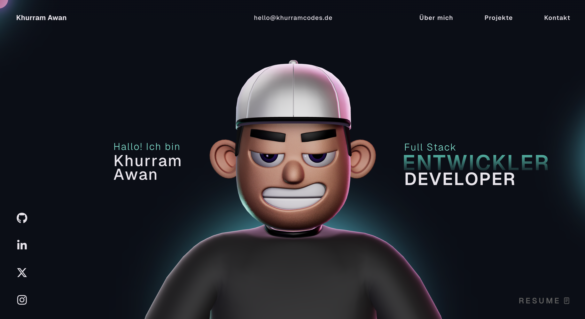

# 🚀 Khurram Codes Portfolio

Ein modernes, interaktives Portfolio, erstellt mit React, Three.js und GSAP, um meine Arbeit, meine Fähigkeiten und meine Projekte zu präsentieren.

---

## 🌐 Live Demo
👉 https://portfolio.khurramcodes.de/

---

## ✨ Features

- Interaktive 3D-Technologie mit Three.js
- Flüssige Animationen dank GSAP
- Vollständig responsives Design (Mobilgeräte + Desktop)
- Moderne Benutzeroberfläche
- Rechtliche Hinweise (Impressum & Datenschutz)

---

## 🛠 Tech Stack

- React
- TypeScript
- Vite
- Three.js (React Three Fiber)
- GSAP
- HTML, CSS, JavaScript

---

## 📸 Preview



---

## ⚙️ Installation

```bash
git clone https://github.com/khurri-collab/khurramcodes-portfolio.git
cd khurramcodes-portfolio
npm install
npm run dev